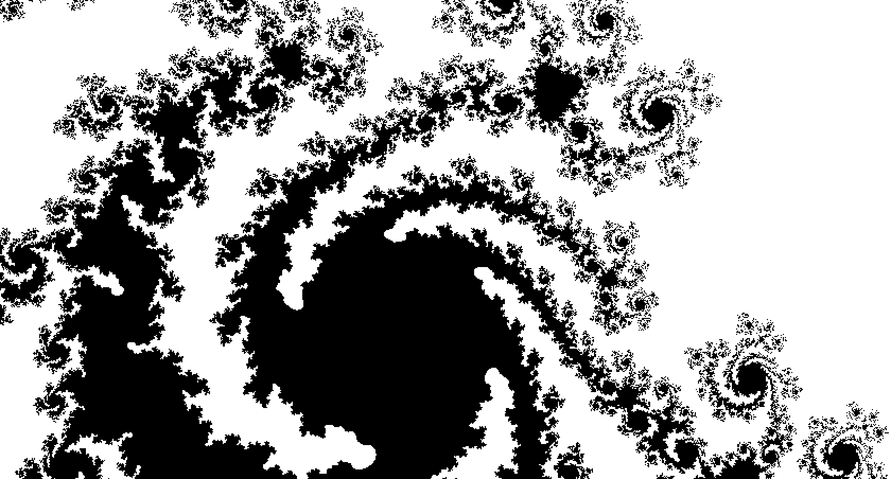

# Discrete Mandelbrot

<div style="text-align: center; margin: 20px 0;">
  
</div>

An interactive GPU-accelerated explorer of the Mandelbrot set rendered with a distinct blocky aesthetic. Rather than plotting individual pixels, this tool snaps calculations to 2x2 pixel blocks, creating a discrete visual language that transforms the infinite fractal into something more graphic and geometric.

## What it is

This is a real-time visualization of the Mandelbrot set using WebGL shader computation. Instead of the traditional z² + c formula, it iterates z⁴ + c, which produces a variation of the classic shape featuring fewer intricate filaments but deeper valleys of complexity. The discrete rendering approach creates a deliberate visual style reminiscent of digital grid aesthetics and early computational graphics.

The entire fractal is computed on the GPU for every pixel, every frame, which means the visualization responds immediately to your navigation. No precomputed tiles, no loading delays.

## Mathematical foundation

The Mandelbrot set emerges from a deceptively simple rule. You take a complex number c, start with z = 0, and repeatedly apply z → z⁴ + c. If this sequence stays bounded after a fixed number of iterations, that point belongs to the set. Plot millions of points this way, and the iconic fractal geometry appears.

By using the fourth power instead of the second, the resulting set maintains the same self-similar structure but expresses it differently. The boundary becomes sharper, the overall shape more compressed, and certain flourishes vanish while others intensify. It demonstrates how sensitive fractal form is to even minor changes in the generating formula.

The discrete pixel blocking isn't just aesthetic. Each 2x2 cell is treated as a single computational unit, evaluated once at its center. This decision gives the rendering a unique character while reducing computation slightly, creating a visual bridge between mathematical purity and digital discreteness.

## Interaction

Navigate the fractal with these controls:

- **Mouse drag** to pan across the complex plane
- **Scroll wheel** to zoom in and out
- **Arrow keys** for fine movement
- **Plus and minus keys** to adjust zoom level

The visualization maintains responsive 30fps interaction across different resolutions, adapting to your window size automatically.

## Customization

The rendering is remarkably open to modification. A few things you could experiment with:

If you adjust the degree in the polynomial, changing z⁴ + c to perhaps z³ + c or z⁵ + c, you get entirely different fractal geometries. Each degree produces its own universe of forms. Lower degrees will render faster but show different structure, while higher degrees create more intricate patterns.

Adjusting the discrete block size from 2x2 to something like 4x4 or 1x1 shifts between graphic abstraction and pixel-level detail. Larger blocks emphasize the algorithmic quality, smaller blocks approach continuity.

The iteration limit (currently 64) controls how deep into the boundary detail you see. Pushing it higher reveals finer structure at the cost of computation.

The color scheme is currently binary black and white, but the shader can easily map iteration count to gradients, creating entirely different visual moods from the same mathematical set.

## Running locally

You'll need a modern browser with WebGL support, and a local web server to avoid CORS issues when loading the shader files.

If you have Python 3 installed, navigate to the project directory and run:
```bash
python -m http.server 8000
```

Then open http://localhost:8000 in your browser. Alternatively, any local server will work.

To clone this project, run:
```bash
git clone https://github.com/QC20/Discrete-Mandelbrot.git
```

## Technical stack

Built with p5.js for the framework and GLSL shaders for GPU computation. The fragment shader contains the core fractal iteration logic, while the vertex shader simply passes through the full-screen quad coordinates.